# Colors

[参考](https://api.flutter.dev/flutter/material/Colors-class.html)

## 常量

- accents → const List\<MaterialAccentColor>  
  The material design accent color swatches.
const \<MaterialAccentColor>[Colors.redAccent, Colors.pinkAccent, Colors.purpleAccent, Colors.deepPurpleAccent, Colors.indigoAccent, Colors.blueAccent, Colors.lightBlueAccent, Colors.cyanAccent, …
- amber → const MaterialColor  
  The amber primary color and swatch.  
const MaterialColor(Colors._amberPrimaryValue, const <int, Color>{50 : const Color(4294965473), 100 : const Color(4294962355), 200 : const Color(4294959234), 300 : const Color(4294956367), 400 :…
- amberAccent → const MaterialAccentColor
The amber accent color and swatch.  
const MaterialAccentColor(Colors._amberAccentPrimaryValue, const <int, Color>{100 : const Color(4294960511), 200 : const Color(Colors._amberAccentPrimaryValue), 400 : const Color(4294951936), 70…
- black → const Color  
  Completely opaque black.  
  const Color(4278190080)
- black12 → const Color
Black with 12% opacity.  
const Color(520093696)
- black26 → const Color
Black with 26% opacity.  
const Color(1107296256)
- black38 → const Color
Black with 38% opacity.  
const Color(1627389952)
- black45 → const Color
Black with 45% opacity.  
const Color(1929379840)
- black54 → const Color
Black with 54% opacity.  
const Color(2315255808)
- black87 → const Color
Black with 87% opacity.  
const Color(3707764736)
- blue → const MaterialColor
The blue primary color and swatch.  
const MaterialColor(Colors._bluePrimaryValue, const <int, Color>{50 : const Color(4293128957), 100 : const Color(4290502395), 200 : const Color(4287679225), 300 : const Color(4284790262), 400 : …
- blueAccent → const MaterialAccentColor
The blue accent color and swatch.  
const MaterialAccentColor(Colors._blueAccentPrimaryValue, const <int, Color>{100 : const Color(4286755327), 200 : const Color(Colors._blueAccentPrimaryValue), 400 : const Color(4280908287), 700 …
- blueGrey → const MaterialColor
The blue-grey primary color and swatch.  
const MaterialColor(Colors._blueGreyPrimaryValue, const <int, Color>{50 : const Color(4293718001), 100 : const Color(4291811548), 200 : const Color(4289773253), 300 : const Color(4287669422), 40…
- brown → const MaterialColor
The brown primary color and swatch.  
const MaterialColor(Colors._brownPrimaryValue, const <int, Color>{50 : const Color(4293913577), 100 : const Color(4292332744), 200 : const Color(4290554532), 300 : const Color(4288776319), 400 :…
- cyan → const MaterialColor
The cyan primary color and swatch.  
const MaterialColor(Colors._cyanPrimaryValue, const <int, Color>{50 : const Color(4292933626), 100 : const Color(4289915890), 200 : const Color(4286635754), 300 : const Color(4283289825), 400 : …
- cyanAccent → const MaterialAccentColor
The cyan accent color and swatch.  
const MaterialAccentColor(Colors._cyanAccentPrimaryValue, const <int, Color>{100 : const Color(4286906367), 200 : const Color(Colors._cyanAccentPrimaryValue), 400 : const Color(4278248959), 700 …
- deepOrange → const MaterialColor
The deep orange primary color and swatch.  
const MaterialColor(Colors._deepOrangePrimaryValue, const <int, Color>{50 : const Color(4294699495), 100 : const Color(4294954172), 200 : const Color(4294945681), 300 : const Color(4294937189), …
- deepOrangeAccent → const MaterialAccentColor
The deep orange accent color and swatch.  
const MaterialAccentColor(Colors._deepOrangeAccentPrimaryValue, const <int, Color>{100 : const Color(4294942336), 200 : const Color(Colors._deepOrangeAccentPrimaryValue), 400 : const Color(42949…
- deepPurple → const MaterialColor
The deep purple primary color and swatch.  
const MaterialColor(Colors._deepPurplePrimaryValue, const <int, Color>{50 : const Color(4293781494), 100 : const Color(4291937513), 200 : const Color(4289961435), 300 : const Color(4287985101), …
- deepPurpleAccent → const MaterialAccentColor
The deep purple accent color and swatch.  
const MaterialAccentColor(Colors._deepPurpleAccentPrimaryValue, const <int, Color>{100 : const Color(4289956095), 200 : const Color(Colors._deepPurpleAccentPrimaryValue), 400 : const Color(42848…
- green → const MaterialColor
The green primary color and swatch.  
const MaterialColor(Colors._greenPrimaryValue, const <int, Color>{50 : const Color(4293457385), 100 : const Color(4291356361), 200 : const Color(4289058471), 300 : const Color(4286695300), 400 :…
- greenAccent → const MaterialAccentColor
The green accent color and swatch.  
const MaterialAccentColor(Colors._greenAccentPrimaryValue, const <int, Color>{100 : const Color(4290377418), 200 : const Color(Colors._greenAccentPrimaryValue), 400 : const Color(4278249078), 70…
- grey → const MaterialColor
The grey primary color and swatch.  
const MaterialColor(Colors._greyPrimaryValue, const <int, Color>{50 : const Color(4294638330), 100 : const Color(4294309365), 200 : const Color(4293848814), 300 : const Color(4292927712), 350 : …
- indigo → const MaterialColor
The indigo primary color and swatch.  
const MaterialColor(Colors._indigoPrimaryValue, const <int, Color>{50 : const Color(4293454582), 100 : const Color(4291152617), 200 : const Color(4288653530), 300 : const Color(4286154443), 400 …
- indigoAccent → const MaterialAccentColor
The indigo accent color and swatch.  
const MaterialAccentColor(Colors._indigoAccentPrimaryValue, const <int, Color>{100 : const Color(4287405823), 200 : const Color(Colors._indigoAccentPrimaryValue), 400 : const Color(4282211070), …
- lightBlue → const MaterialColor
The light blue primary color and swatch.  
const MaterialColor(Colors._lightBluePrimaryValue, const <int, Color>{50 : const Color(4292998654), 100 : const Color(4289979900), 200 : const Color(4286698746), 300 : const Color(4283417591), 4…
- lightBlueAccent → const MaterialAccentColor
The light blue accent swatch.  
const MaterialAccentColor(Colors._lightBlueAccentPrimaryValue, const <int, Color>{100 : const Color(4286634239), 200 : const Color(Colors._lightBlueAccentPrimaryValue), 400 : const Color(4278235…
- lightGreen → const MaterialColor
The light green primary color and swatch.  
const MaterialColor(Colors._lightGreenPrimaryValue, const <int, Color>{50 : const Color(4294047977), 100 : const Color(4292668872), 200 : const Color(4291158437), 300 : const Color(4289648001), …
- lightGreenAccent → const MaterialAccentColor
The light green accent color and swatch.  
const MaterialAccentColor(Colors._lightGreenAccentPrimaryValue, const <int, Color>{100 : const Color(4291624848), 200 : const Color(Colors._lightGreenAccentPrimaryValue), 400 : const Color(42859…
- lime → const MaterialColor
The lime primary color and swatch.  
const MaterialColor(Colors._limePrimaryValue, const <int, Color>{50 : const Color(4294573031), 100 : const Color(4293981379), 200 : const Color(4293324444), 300 : const Color(4292667253), 400 : …
- limeAccent → const MaterialAccentColor
The lime accent primary color and swatch.  
const MaterialAccentColor(Colors._limeAccentPrimaryValue, const <int, Color>{100 : const Color(4294246273), 200 : const Color(Colors._limeAccentPrimaryValue), 400 : const Color(4291231488), 700 …
- orange → const MaterialColor
The orange primary color and swatch.  
const MaterialColor(Colors._orangePrimaryValue, const <int, Color>{50 : const Color(4294964192), 100 : const Color(4294959282), 200 : const Color(4294954112), 300 : const Color(4294948685), 400 …
- orangeAccent → const MaterialAccentColor
The orange accent color and swatch.  
const MaterialAccentColor(Colors._orangeAccentPrimaryValue, const <int, Color>{100 : const Color(4294955392), 200 : const Color(Colors._orangeAccentPrimaryValue), 400 : const Color(4294938880), …
- pink → const MaterialColor
The pink primary color and swatch.  
const MaterialColor(Colors._pinkPrimaryValue, const <int, Color>{50 : const Color(4294763756), 100 : const Color(4294491088), 200 : const Color(4294217649), 300 : const Color(4293943954), 400 : …
- pinkAccent → const MaterialAccentColor
The pink accent color swatch.  
const MaterialAccentColor(Colors._pinkAccentPrimaryValue, const <int, Color>{100 : const Color(4294934699), 200 : const Color(Colors._pinkAccentPrimaryValue), 400 : const Color(4294246487), 700 …
- primaries → const List\<MaterialColor>
The material design primary color swatches, excluding grey.
const \<MaterialColor>[Colors.red, Colors.pink, Colors.purple, Colors.deepPurple, Colors.indigo, Colors.blue, Colors.lightBlue, Colors.cyan, Colors.teal, Colors.green, Colors.lightGreen, Colors.l…
- purple → const MaterialColor
The purple primary color and swatch.  
const MaterialColor(Colors._purplePrimaryValue, const <int, Color>{50 : const Color(4294174197), 100 : const Color(4292984551), 200 : const Color(4291728344), 300 : const Color(4290406600), 400 …
- purpleAccent → const MaterialAccentColor
The purple accent color and swatch.  
const MaterialAccentColor(Colors._purpleAccentPrimaryValue, const <int, Color>{100 : const Color(4293558524), 200 : const Color(Colors._purpleAccentPrimaryValue), 400 : const Color(4292149497), …
- red → const MaterialColor
The red primary color and swatch.  
const MaterialColor(Colors._redPrimaryValue, const <int, Color>{50 : const Color(4294962158), 100 : const Color(4294954450), 200 : const Color(4293892762), 300 : const Color(4293227379), 400 : c…
- redAccent → const MaterialAccentColor
The red accent swatch.  
const MaterialAccentColor(Colors._redAccentValue, const <int, Color>{100 : const Color(4294937216), 200 : const Color(Colors._redAccentValue), 400 : const Color(4294907716), 700 : const Color(42…
- teal → const MaterialColor
The teal primary color and swatch.  
const MaterialColor(Colors._tealPrimaryValue, const <int, Color>{50 : const Color(4292932337), 100 : const Color(4289912795), 200 : const Color(4286630852), 300 : const Color(4283283116), 400 : …
- tealAccent → const MaterialAccentColor
The teal accent color and swatch.  
const MaterialAccentColor(Colors._tealAccentPrimaryValue, const <int, Color>{100 : const Color(4289200107), 200 : const Color(Colors._tealAccentPrimaryValue), 400 : const Color(4280150454), 700 …
- transparent → const Color
Completely invisible.
const Color(0)
- white → const Color
Completely opaque white.  
const Color(4294967295)
- white10 → const Color
White with 10% opacity.  
const Color(452984831)
- white12 → const Color
White with 12% opacity.  
const Color(536870911)
- white24 → const Color
White with 24% opacity.  
const Color(1040187391)
- white30 → const Color
White with 30% opacity.  
const Color(1308622847)
- white54 → const Color
White with 54% opacity.  
const Color(2332033023)
- white60 → const Color
White with 60% opacity.  
const Color(2583691263)
- white70 → const Color
White with 70% opacity.  
const Color(3019898879)
- yellow → const MaterialColor
The yellow primary color and swatch.  
const MaterialColor(Colors._yellowPrimaryValue, const <int, Color>{50 : const Color(4294966759), 100 : const Color(4294965700), 200 : const Color(4294964637), 300 : const Color(4294963574), 400 …
- yellowAccent → const MaterialAccentColor
The yellow accent color and swatch.  
const MaterialAccentColor(Colors._yellowAccentPrimaryValue, const <int, Color>{100 : const Color(4294967181), 200 : const Color(Colors._yellowAccentPrimaryValue), 400 : const Color(4294961664), …

## 举个例子

1. Color

    ```dart
    Color selection = Colors.green[400]; // 选择了中间的绿色.
    ```

2. ColorSwatch

    ```dart
    Container(
    color: Colors.blue, // 等同于 Colors.blue[500] 或 Colors.blue.shade500
    )
    ```

## 调色板

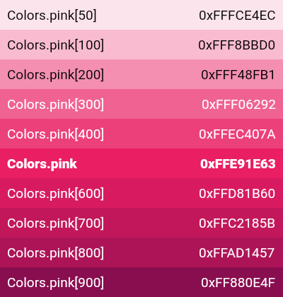  
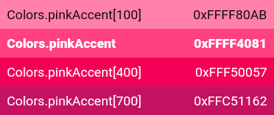  
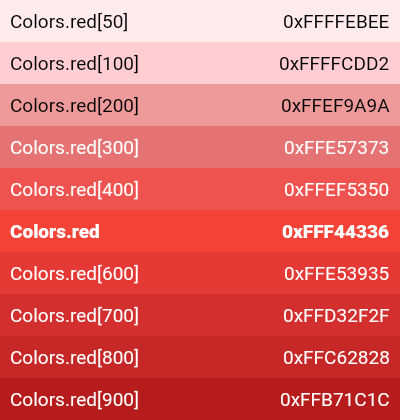  
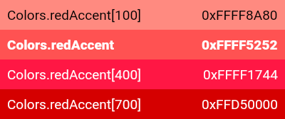  
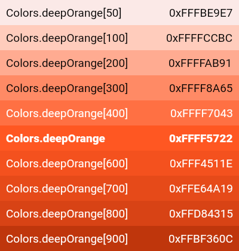  
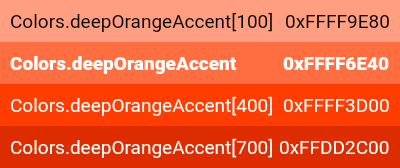  
  
  
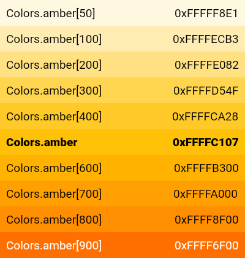  
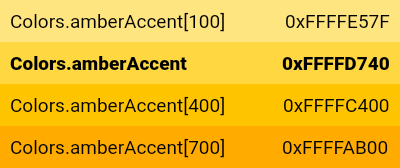  
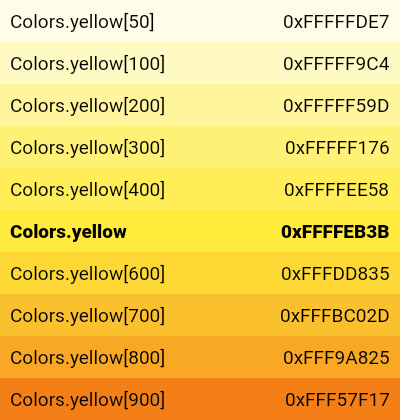  
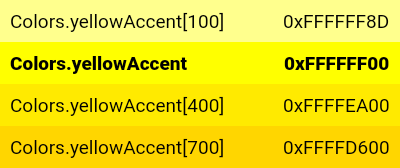  
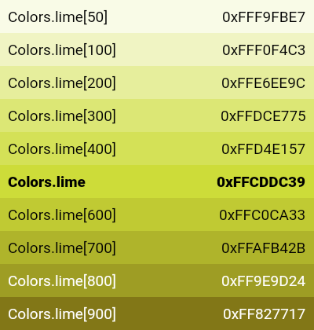  
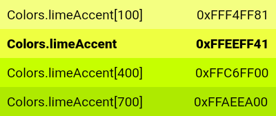  
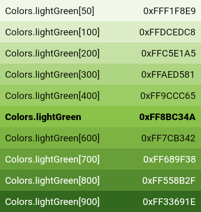  
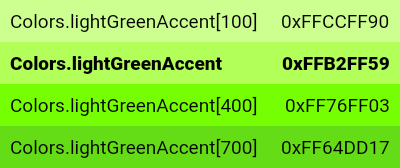  
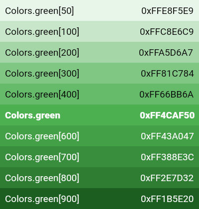  
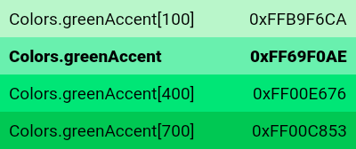  
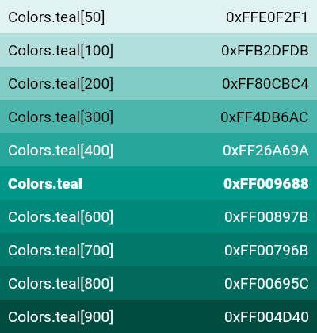  
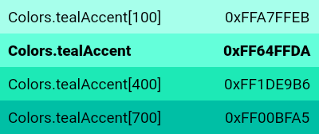  
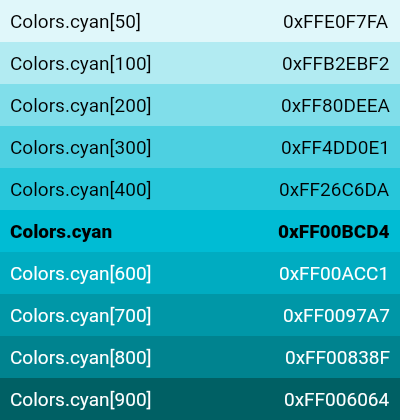  
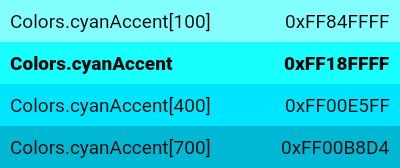
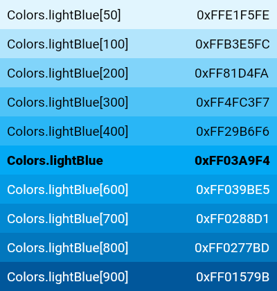  
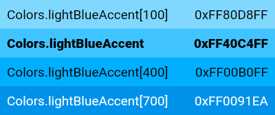
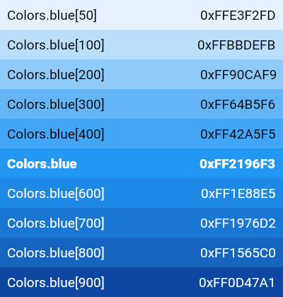  
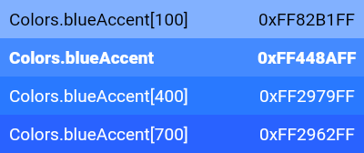
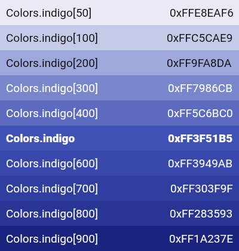  
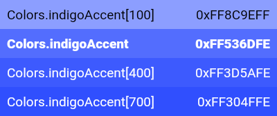
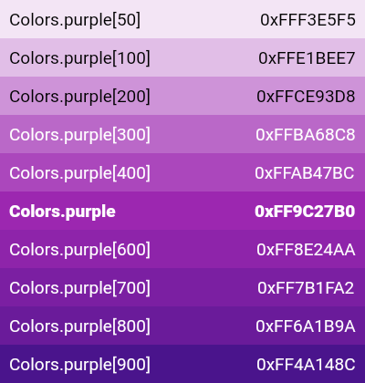  
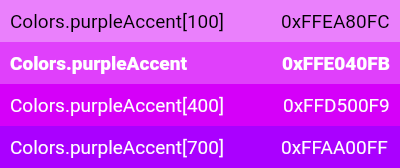
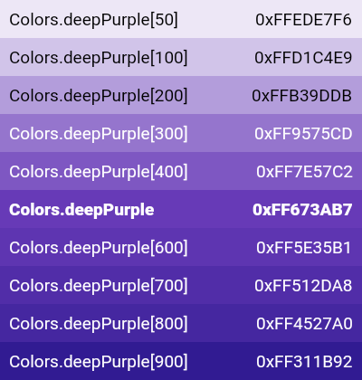  
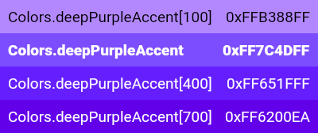
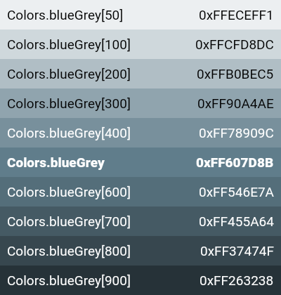  
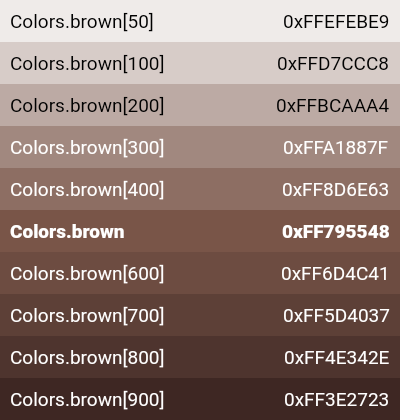
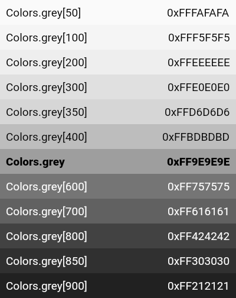  
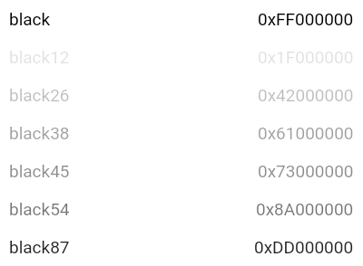
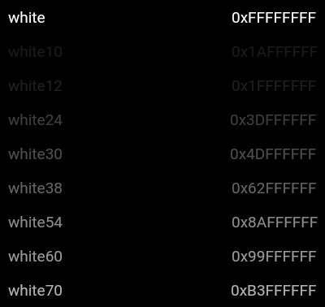  
